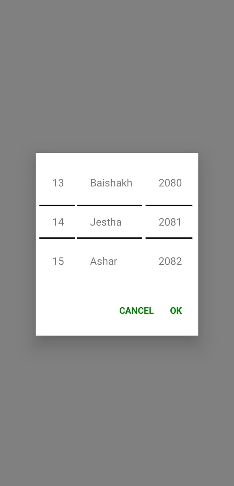

# Nepali Calendar Component
The Nepali Calendar Component is a versatile and user-friendly React Native component designed to provide a seamless calendar experience for users worldwide. This component not only displays the traditional Nepali calendar but also allows you to integrate and manage other dates, making it suitable for all types of calendars.

### Features
Traditional Nepali Calendar: Displays dates according to the Bikram Sambat (BS) calendar system used in Nepal.
Multiple Calendar Support: Easily add and manage dates from other calendar systems, such as Gregorian, Hijri, or any custom calendar.
Customizable Events: Add, edit, and delete events or important dates directly on the calendar.
Localization: Supports localization for different languages and regions, ensuring a user-friendly experience for a global audience.
Responsive Design: Adapts to various screen sizes and orientations, providing a consistent experience across different devices.
Theming: Easily customizable themes to match your app's design and branding.
Installation
To install the Nepali Calendar Component, run the following command:

bash
Copy code
npm install nepali-calendar-component
Usage
Here’s how to integrate the Nepali Calendar Component into your React Native project:

### Javascript
### Copy code
import React from 'react';
import { View, StyleSheet } from 'react-native';
import NepaliCalendar from 'nepali-calendar-component';

const App = () => {
  const [selectedDateBs, setSelectedDateBs] = useState(null);
  return (
    <View style={[styles.container, styles.shadowBackground]}>
      <Text>DateBs: </Text>
      <Text>{JSON.stringify(selectedDateBs)}</Text>
      <NepaliCalander currentDate={selectedDateBs} onOk={(date) => { setSelectedDateBs(date) }} textStyle={null} tableStyle={styles.datePicker} />
    </View>
  );
};

export default App;

### Props
onDateSelect: Function called when a date is selected. Receives the selected date as an argument.
events: Array of event objects with date and title properties to display on the calendar.
theme: Object for customizing the appearance of the calendar.
locale: String for setting the language/locale of the calendar.
Event Object Structure
Each event object should have the following structure:

### javascript
Copy code
{
  currentDate: 'YYYY-MM-DD', // Date in Bikram Sambat or Gregorian calendar
  label: 'Event Title' // Title of the event
}

### Theming Options
Customize the look and feel of the calendar with the following theme properties:
currentDate: Date which is active. 'YYYY-MM-DD"
label: Text input label
onOk: After pressing ok
textStyle: Custom styles of text input.
tableStyle: Outer style of input
customYearList: Custom year like: [{ "id": "0", "title": "1955", "totalMonth": 12, "value": 1955 },......]
customMonthList: Custom month like: [{ id: "0", title: "Baishakh", totalDays: 31, value: 1 },.....]
customDayList: Custome days like:   
  [{ "id": "0", "title": "1", "value": 1 },....]
Localization
Set the locale prop to change the language of the calendar. Currently supported locales include:

### Contributing
We welcome contributions from the community! If you have ideas for new features or improvements, please submit a pull request or open an issue on our GitHub repository.

### License
This component is licensed under the MIT License.

### Support
If you have any questions or need assistance, please feel free to reach out via GitHub Issues.